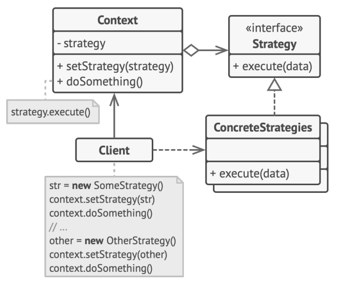
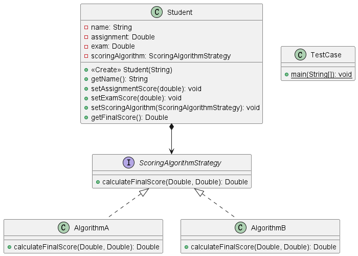

**设计模式的选择：**

在给定的案例中，我们选择了**策略模式**设计模式。策略模式是一种行为型设计模式，它允许定义一系列算法，将每个算法封装成一个类，并且使它们可互换。在这个情景中，我们创建了两个算法类（`AlgorithmA` 和 `AlgorithmB`）来表示不同的计算最终分数的策略。这些算法能够被动态切换，因此，我们将它们封装在 `ScoringAlgorithm` 接口中。

**策略模式概述：**

策略模式属于行为型设计模式，它允许定义一系列算法，使得它们之间可以相互替换，而不影响客户端使用。在策略模式中，我们有一个上下文对象（在这里是 `Student` 类），它持有一个策略对象（在这里是 `ScoringAlgorithm` 接口的实现类），并且可以动态地切换这个策略对象。这种方式使得算法的选择不再是在编译时确定的，而是在运行时可以灵活变化。

**策略模式的常见方法：**

1. **Context（上下文）：** 持有一个策略对象，并在需要的时候调用策略对象的方法。

2. **Strategy（策略）：** 定义一个算法族，将每个算法封装起来，并使它们可以相互替换。

3. **ConcreteStrategy（具体策略）：** 实现策略接口的具体算法类。

**本题情景与策略模式的联系：**

- **Context（上下文）：** `Student` 类是上下文对象，持有一个 `ScoringAlgorithm` 接口的引用。

- **Strategy（策略）：** `ScoringAlgorithm` 接口是策略，定义了计算最终分数的方法。

- **ConcreteStrategy（具体策略）：** `AlgorithmA` 和 `AlgorithmB` 是具体策略，分别实现了 `ScoringAlgorithm` 接口，代表两种不同的计算分数的算法。

**为什么使用策略模式：**

1. **动态切换算法：** 在本题目中，我们需要在运行时能够切换不同的算法。策略模式允许我们在不修改上下文类的情况下动态切换算法。

2. **可扩展性：** 新的算法可以轻松地添加到系统中，而不必修改现有的代码。这符合题目要求，即可以通过进行少量的修改来添加新的计算分数的算法。

3. **减少条件语句：** 策略模式通过将不同的算法封装到各自的类中，避免了大量的条件语句。这使得代码更加清晰、可维护。

在策略模式中，上下文对象（`Student` 类）和算法（`ScoringAlgorithm` 接口及其实现类）之间的松耦合关系使得系统更加灵活、可扩展。